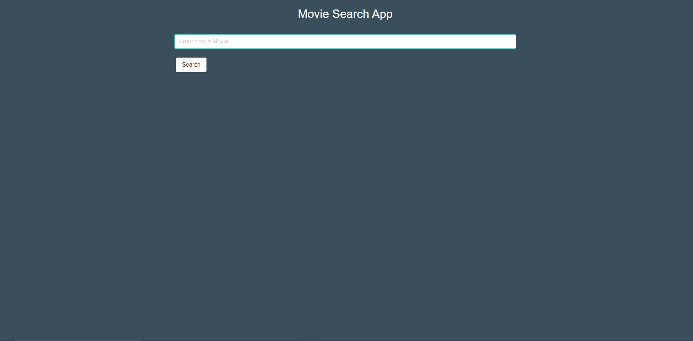
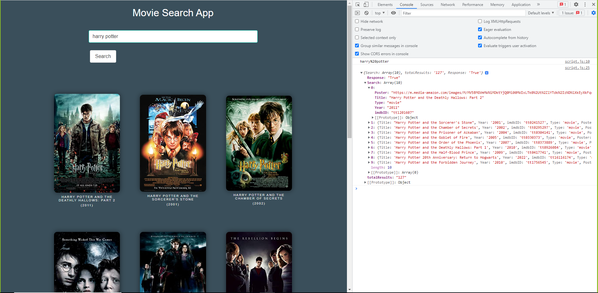
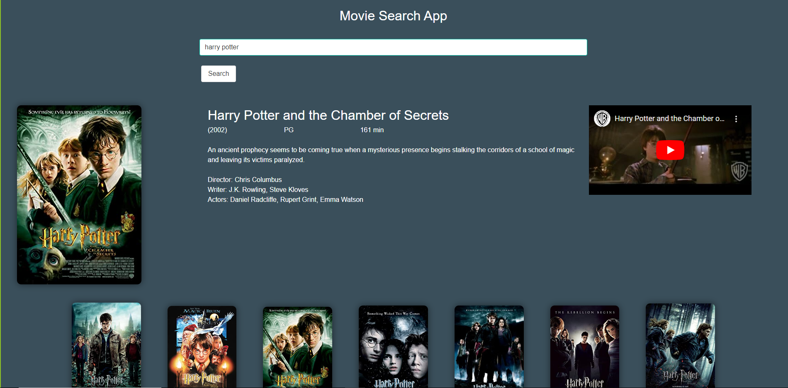
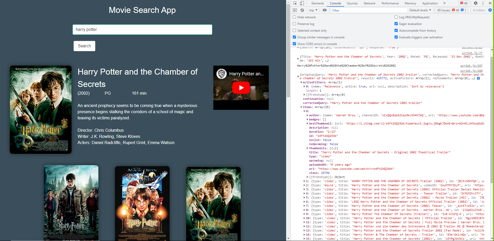
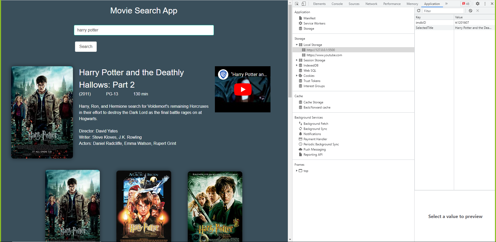

# Bootcamp-Project1-MovieDatabaseApp
UT Austin coding bootcamp project 1 Movie Database app

## Description
The following website is a random password generator that will prompt the user to respond to several criteria selectors and provide a randomized password based on a selected length, and character type criteria.
## Installation
N/A
## Usage
Go to the following URL:
https://airen22.github.io/Bootcamp-Challenge3/
The following image shows a screenshot of the website: 
## Credits
Karen Peazzoni: https://github.com/kpeazzoni/UTA-JS-Challenge-3
## License
Please refer to the LICENSE in the repo.

Landing page formated with bulma 

