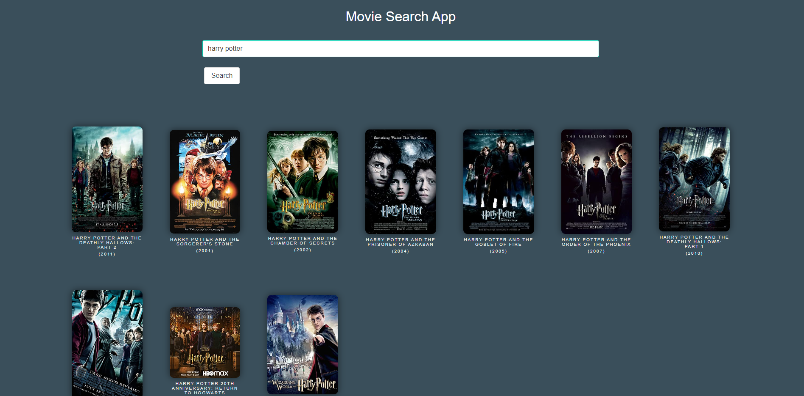

# Bootcamp-Project1-MovieDatabaseApp
UT Austin coding bootcamp project 1 Movie Database App

## Description
The following website is a movie database where the user can type in a movie title and it will return several results that the user can select. Upon selecting a movie the app will populate a poster of the movie, information about the movie, and embed a video of the trailer from YouTube.

## Installation
N/A

## Usage
Go to the following URL:
https://airen22.github.io/Bootcamp-Project1-MovieDatabaseApp/

The following image shows a screenshot of the website landing page:

User types a movie into the search bar and clicks enter and the page will show results of the searched term:

User can click on one of the results on the page and the page will show additional details about the selected movie:

User data is stored in local storage for the search term and the ID for the selected movie ID

The first console log is used to show API response for the search term and pull the data:

The second console log is used to show the API response for the YouTube video and pull the ID to imbed the video in the page:

## Limitations
* The API for the movie database we used is not maintained on a regular basis and some of the movie titles do not exist/populate due to API request failure. 

* The app can only accurately (in a relative sense, based on the limitations of the API) search movie titles. Any names do not return the movies that the name is associated with (i.e. "will smith" does not return movies that Will Smith has been in).

## Credits
* CSS Framework: https://bulma.io/
* Style elements: The Movie Database - Marco Biedermann (https://codepen.io/marcobiedermann/pen/xxeeXw)
* Movie Database API: Movie database API: https://rapidapi.com/rapidapi/api/movie-database-alternative/details
* YouTube API: YouTube API: https://rapidapi.com/marindelija/api/youtube-search-results/
* concept inspired by: https://www.movierankings.net/random
* concept inspired by: imdb.com

## License
Please refer to the LICENSE in the repo.

